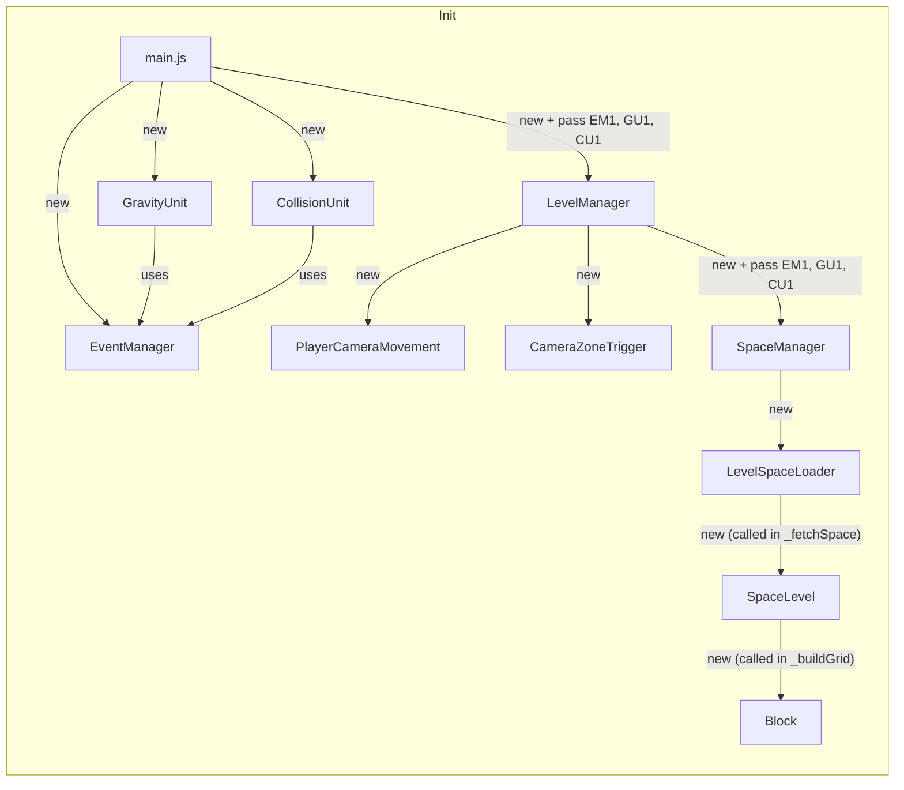
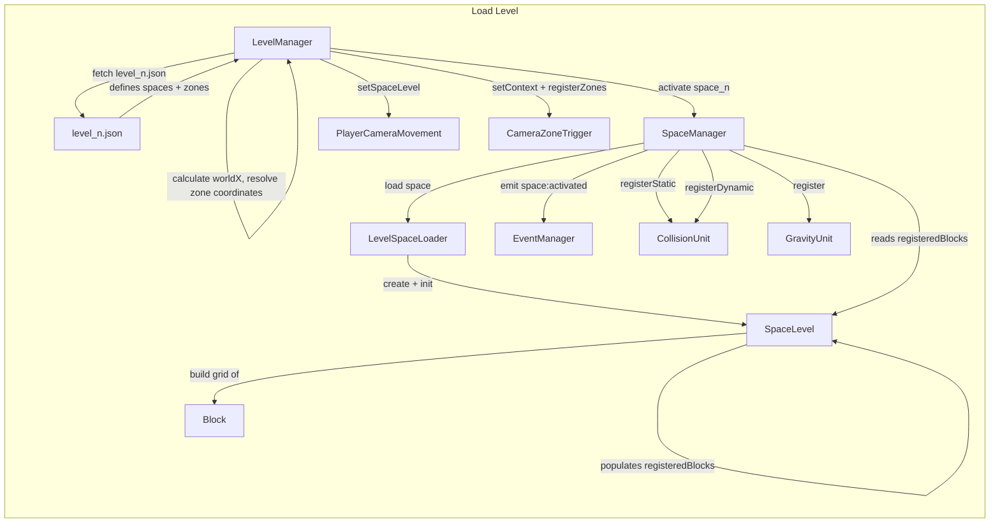
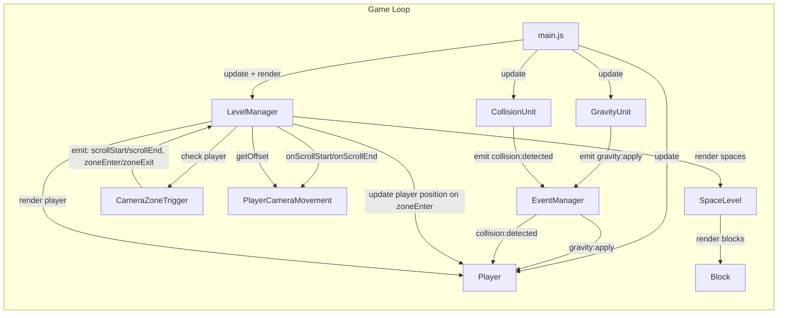

# simple-platformer

## How to run
**Android:** You can use Acode, then run `index.html`  
**PC:** Run `python -m http.server 8080` from the root directory, then open `http://localhost:8080` in your browser  

---

## Architecture

### Class interactions

