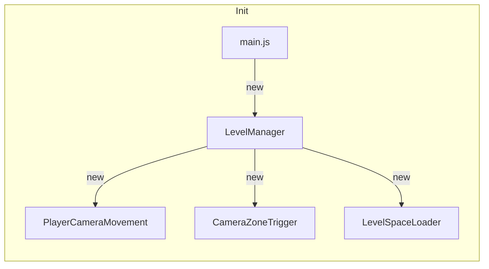
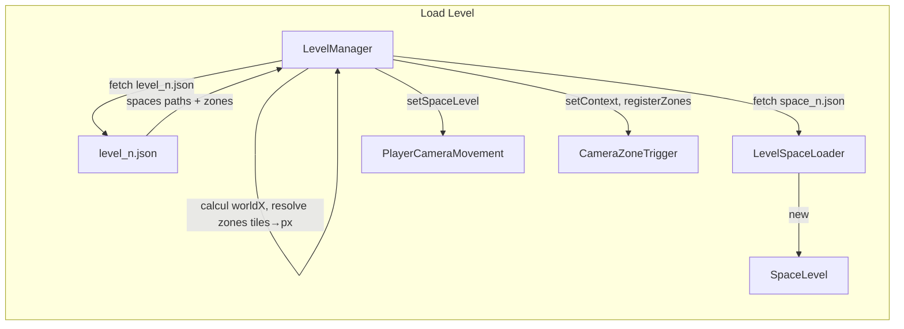
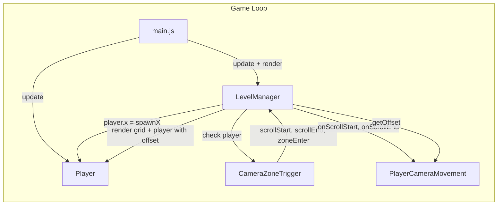

# simple-platformer

## How to run
**Android:** You can use Acode, then run `index.html`  
**PC:** Run `python -m http.server 8080` from the root directory, then open `http://localhost:8080` in your browser  

---

## Architecture

### Class interactions

### Classes

**main.js**
Entry point. Creates the canvas, instantiates `LevelManager` and `Player`, starts the game loop via `requestAnimationFrame`, and handles window resize.

**LevelManager**
Central coordinator. Owns all systems and is the only class that knows about the others. Calls `update` and `render` each frame, listens to events from `CameraZoneTrigger` and dispatches them to the appropriate systems.

**ResourceManager**
Provides level definitions: list of SpaceLevels, trigger zones, and the player start position. Will later handle loading from JSON files or other assets.

**CameraZoneTrigger**
Detects thresholds within the active SpaceLevel (mid-point and end-point) as well as custom zones defined in the level. Emits events to `LevelManager` when the player crosses them.

**PlayerCameraMovement**
Manages the camera offset across three phases: fixed at the start of the SpaceLevel, scrolling to keep the player centered once the mid-point is reached, and fixed again once the end of the SpaceLevel fills the canvas.

**LevelSpaceLoader**
Stub for now. Will later handle loading and caching SpaceLevel content, either from memory cache or from files depending on availability.

**Player**
Keyboard-controlled rectangle. Moves in four directions, rendered with the camera offset applied.

### Concepts

**SpaceLevel / bounds** — the physical area of a level segment in world space. A level is composed of one or more SpaceLevels chained together. The canvas is a fixed-size window that shows a portion of this world.

**Camera phases** — the camera behavior within a SpaceLevel follows three stages driven by the player's position relative to the SpaceLevel bounds and canvas width.
