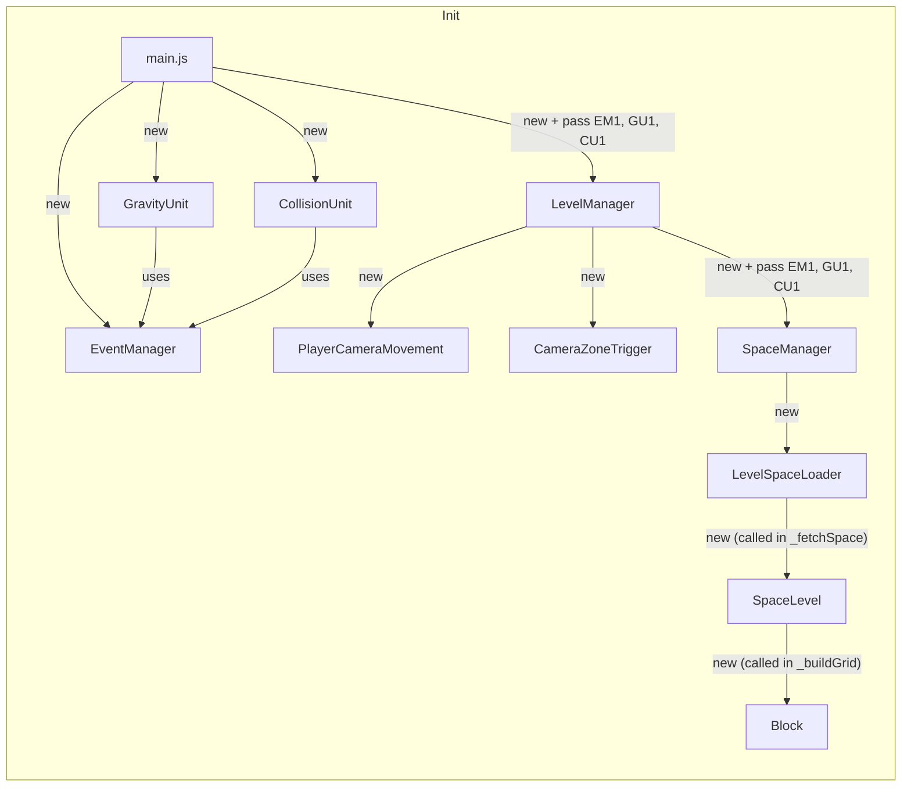
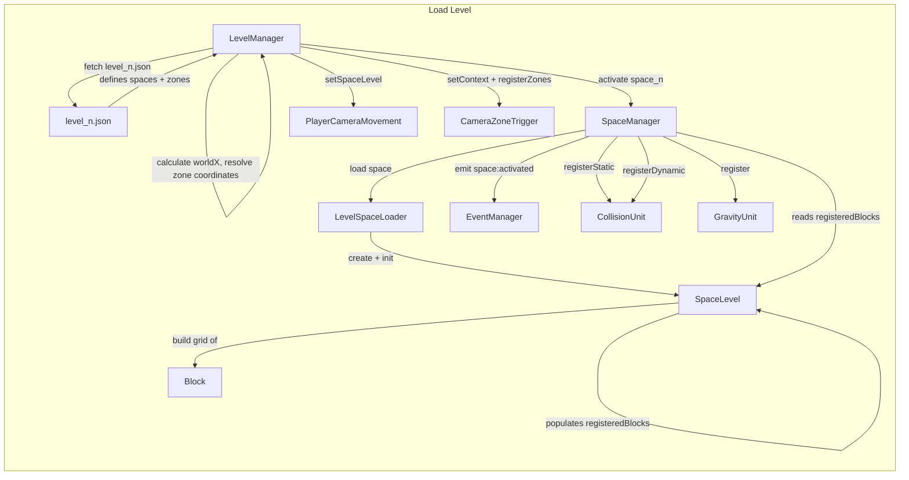
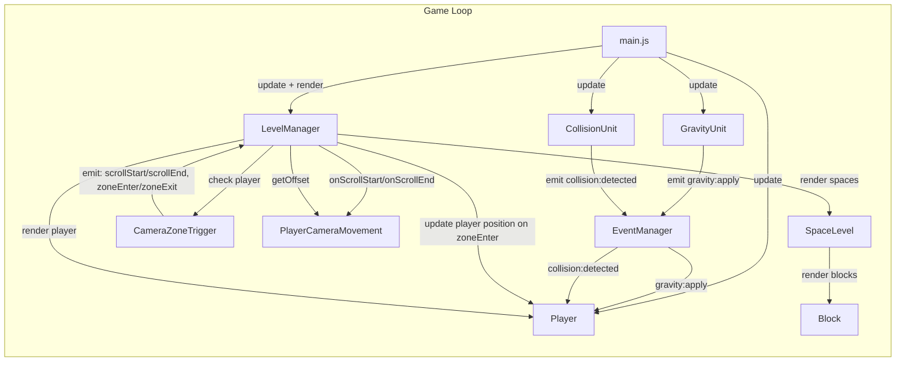
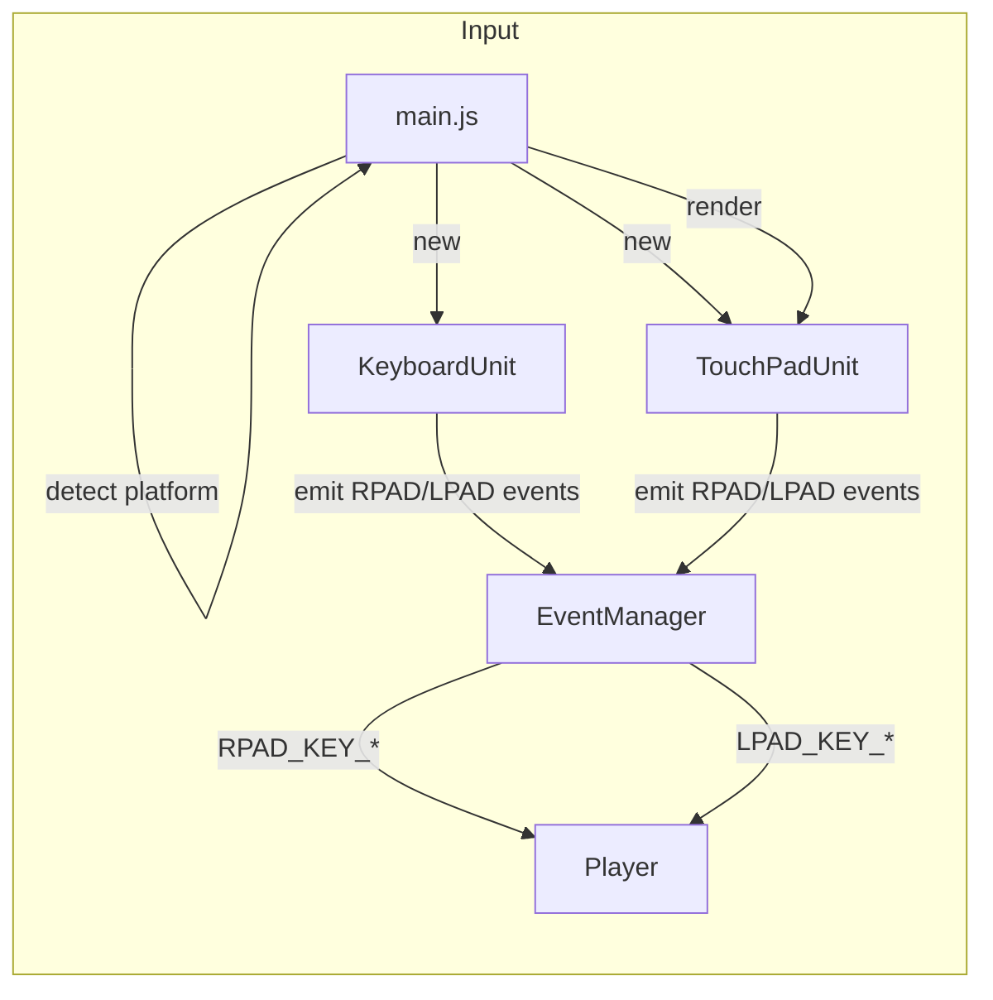

# Simple Platformer

## How to run

### On Android

1. You can use something like **Acode** in the `www` folder and open `index.html`.

2. Or build a signed APK:

#### Generate your key (keystore)

```bash
keytool -genkeypair \
  -alias simpleplatformer \
  -keyalg RSA \
  -keysize 2048 \
  -validity 10000 \
  -keystore simpleplatformer.keystore \
  -dname "CN=EdleCode, OU=Dev, O=EdleCode, L=Paris, ST=Ile-de-France, C=FR" \
  -storepass password123 \
  -keypass password123
````

#### Build the APK

```bash
cordova build android --release -- --packageType=apk
```

#### Sign the APK

```bash
$ANDROID_SDK_ROOT/build-tools/36.0.0/apksigner sign \
  --ks simpleplatformer.keystore \
  --ks-key-alias simpleplatformer \
  --ks-pass pass:password123 \
  --key-pass pass:password123 \
  --out platforms/android/app/build/outputs/apk/release/app-release-signed.apk \
  platforms/android/app/build/outputs/apk/release/app-release-unsigned.apk
```

### On PC

1. Go to the `www` folder.

2. Run a local server:

* For localhost only:

```bash
python -m http.server 8080
```

* For local network access:

```bash
python -m http.server 8080 --bind 192.168.x.x
```

3. Open in browser:

```
http://localhost:8080
```


---

## Architecture

### Class interactions

**1. Initialization - dependency injection**

```mermaid
graph LR
    subgraph init["Init"]
        main1["main.js"] -->|new| EM1["EventManager"]
        main1 -->|new| GU1["GravityUnit"]
        main1 -->|new| CU1["CollisionUnit"]
        GU1 -->|uses| EM1
        CU1 -->|uses| EM1
        main1 -->|new + pass EM1, GU1, CU1| LM1["LevelManager"]
        LM1 -->|new| PCM1["PlayerCameraMovement"]
        LM1 -->|new| CZT1["CameraZoneTrigger"]
        LM1 -->|new + pass EM1, GU1, CU1| SM1["SpaceManager"]
        SM1 -->|new| LSL1["LevelSpaceLoader"]
        LSL1 -->|"new (called in _fetchSpace)"| SL1["SpaceLevel"]
        SL1 -->|"new (called in _buildGrid)"| BL1["Block"]
    end
```

**2. Level loading - space building and entity registration**

```mermaid
graph LR
    subgraph load["Load Level"]
        LM2["LevelManager"] -->|fetch level_n.json| JSON2["level_n.json"]
        JSON2 -->|defines spaces + zones| LM2
        LM2 -->|calculate worldX, resolve zone coordinates| LM2
        LM2 -->|activate space_n| SM2["SpaceManager"]
        SM2 -->|load space| LSL2["LevelSpaceLoader"]
        LSL2 -->|create + init| SL2["SpaceLevel"]
        SL2 -->|build grid of| BL2["Block"]
        SL2 -->|populates registeredBlocks| SL2
        SM2 -->|reads registeredBlocks| SL2
        SM2 -->|emit space:activated| EM2["EventManager"]
        SM2 -->|registerStatic| CU2["CollisionUnit"]
        SM2 -->|registerDynamic| CU2
        SM2 -->|register| GU2["GravityUnit"]
        LM2 -->|setSpaceLevel| PCM2["PlayerCameraMovement"]
        LM2 -->|setContext + registerZones| CZT2["CameraZoneTrigger"]
    end
```

**3. Game loop - update, physics and rendering**

```mermaid
graph LR
    subgraph loop["Game Loop"]
        main3["main.js"] -->|update| PL3["Player"]
        main3 -->|update| GU3["GravityUnit"]
        GU3 -->|emit gravity:apply| EM3["EventManager"]
        EM3 -->|gravity:apply| PL3
        main3 -->|update| CU3["CollisionUnit"]
        CU3 -->|emit collision:detected| EM3
        EM3 -->|collision:detected| PL3
        main3 -->|update + render| LM3["LevelManager"]
        LM3 -->|check player| CZT3["CameraZoneTrigger"]
        CZT3 -->|emit: scrollStart/scrollEnd, zoneEnter/zoneExit| LM3
        LM3 -->|onScrollStart/onScrollEnd| PCM3["PlayerCameraMovement"]
        LM3 -->|getOffset| PCM3
        LM3 -->|update player position on zoneEnter| PL3
        LM3 -->|render spaces| SL3["SpaceLevel"]
        SL3 -->|render blocks| BL3["Block"]
        LM3 -->|render player| PL3
    end
```

**4. Input - keyboard / mobile abstraction to player**

```mermaid
graph LR
    subgraph input["Input"]
        main["main.js"] -->|detect platform| main
        main -->|new| KU["KeyboardUnit"]
        main -->|new| TPU["TouchPadUnit"]
        KU -->|emit RPAD/LPAD events| EM["EventManager"]
        TPU -->|emit RPAD/LPAD events| EM
        EM -->|RPAD_KEY_*| PL["Player"]
        EM -->|LPAD_KEY_*| PL
        main -->|render| TPU
    end
```
